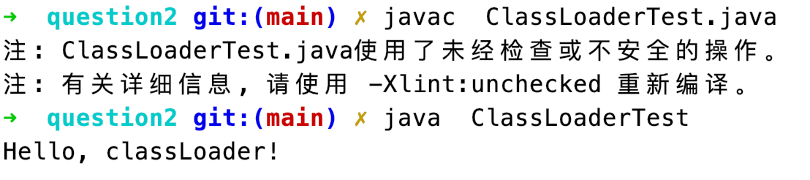

# Question2
# 问题
自定义一个Classloader，加载一个Hello.xlass文件，执行hello方法，此文件内容是 一个Hello.class文件所有字节(x=255-x)处理后的文件。文件群里提供。

# 解答
代码如下
```java
import java.io.File;
import java.io.FileInputStream;
import java.io.IOException;

class ClassLoaderTest extends ClassLoader {

    public static void main(String[] args) {
        try {
            Class hello = new ClassLoaderTest().findClass("/Users/luoxiaolong/workspace/JAVA-000/Week_01/question2/Hello.xlass");
            hello.getMethod("hello").invoke(hello.newInstance());
        } catch (Exception e) {
            e.printStackTrace();
        }
    }
    @Override
    protected Class<?> findClass(String path) throws ClassNotFoundException {
        File classFile = new File(path);
        try (FileInputStream reader = new FileInputStream(classFile)) {
            int src;
            byte[] org = new byte[1024];
            int length = 0;
            while ((src = reader.read()) != -1) {
                org[length] = (byte) ((255 - src) & 0xFF);
                length++;
            }
            return defineClass("Hello", org, 0, length);
        } catch (IOException e) {
            e.printStackTrace();
        }
        throw new ClassNotFoundException(path);
    }
}
```

运行结果截图
